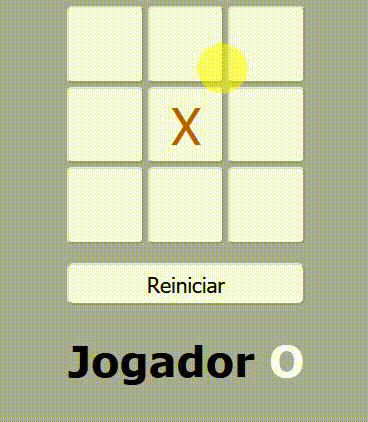

Para instalar as dependências:

```pip install -r requirements.txt```

Para executar: 

```python JogoDaVelha.py```

Abra o navegador: `http://127.0.0.1:5000/`

# Brinque:



# Apresentação do Algorítimo Minimax:

[CLIQUE AQUI](https://docs.google.com/document/d/1nG6pZ6RgE8vLRkljpcTs-NIyQ5gdewoMLTxhVPKpCoc/edit?usp=sharing)